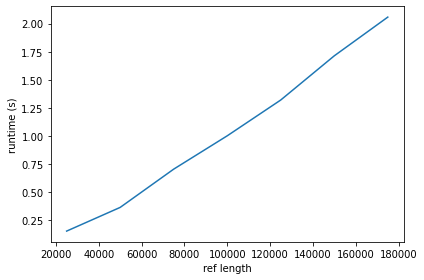

# Project 4: BWT-based matching (FM-index)

Now that you have a functioning suffix array, you should implement the BWT-based search, also known as FM-index. This algorithm improves the search in the suffix array from O(m log n + z) to O(m + z) after O(n) preprocessing (plus whatever time it takes you to build your suffix array).

You should implement a suffix array construction algorithm. You can choose to implement the naive algorithm where you explicitly sort strings, or the O(n) skew or SAIS algorithms, or any other algorithm. After constructing the suffix array, you should implement the binary search based and the Burrows-Wheeler based search algorithm.

The algorithms should be implemented in a program named `fm`. Since we are building data structures in a preprocessing step, and since a common usage of read mappers is to map multiple files of reads against the same genome, we should build the tool such that we can preprocess a genome once, and then reuse the preprocessed data on subsequent searches.

Therefore, your tool should have options for either preprocessing or read-mapping. If you run it as `fm -p genome.fa` it should preprocess the sequences in `genome.fa`, and if you run the tool as  `fm genome.fa reads.fq` it should search the genome and produce output in the same format as the previous projects.

When you preprocess `genome.fa` you should write the result to file. You are free to choose what you write to file, how many files you use, or how you represent the output. Use the input file name, here `genome.fa` but it can be any file name, to select the file names for your preprocessed data. That way, when you run a search with `fm genome.fa reads.fq`, your tool can determine which preprocessed files to read from the second first argument.

## Evaluation

Once you have implemented the `fm` program (and tested it to the best of your abilities) fill out the report below, and notify me that your pull request is ready for review.

# Report

## Preprocessing
*What preprocessing data do you store in files, and how?*

# ANWSER:
I store the alphabet (.txt file), quantification of each letter (.txt file), an index of each letters lex-order (.txt file), the bwt F column (.txt file), the bwt L column (.txt file), a reduced table containing the accumulated counts of each letter of the L column (.txt file), and a reduced SA array (.txt file). 

All files are stored (as the representation) of either a dict or list in a seperate dir for each fasta rec.
This is not the most elegant or sufficient way of storing this information, but it is easy - and i plan to use min-LCP skipping for my final project, so there ill only have to store the suffix array as a single file. 

## Insights you may have had while implementing the algorithm
The implementation i found quite hard since you kind of have to do multiple things at a time since we are using all these different tables/data-structures simuntaniusly.  

## Problems encountered if any
...

## Validation

*How did you validate that the preprocessing and the search algorithm works?*

I generated/simulated a bunch of random dna strings and exact patterns. I used these to compare the performance of my implementation against the naive algorithm. 

## Running time

*List experiments and results that show that both the preprocessing algorithm and the search algorithm works in the expected running time. Add figures by embedding them here, as you learned how to do in project 1.*

Runtimes of datasrtucture construction (F, L, reduced SA, reduced table of accumulating counts of L):

Runtimes for varying read lengths:

I make the F and L columns using my prefig-doubling SA construction algorithm from last project (O(n Log(n))).
I guess the extra forloop to make F/L from the SA gives a total runtime of O(n Log(n) + n)?

So the teoretical runtime for the read mapping part is O(n) (since the lookup in the tables are O(1)). My runtimes look pretty constant which i expect is because my get_SA_offsets() function runs pretty slow and therefore blurs whats going on behind it. 

